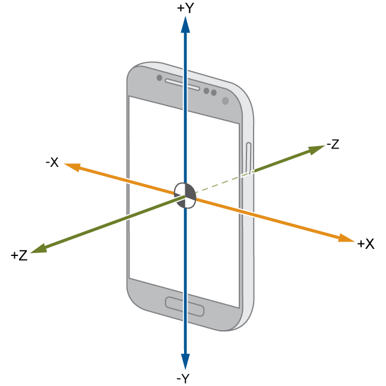
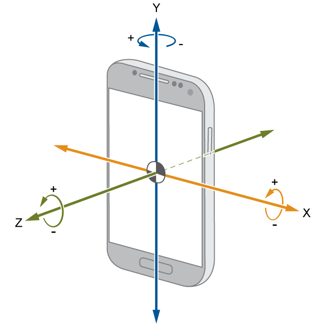
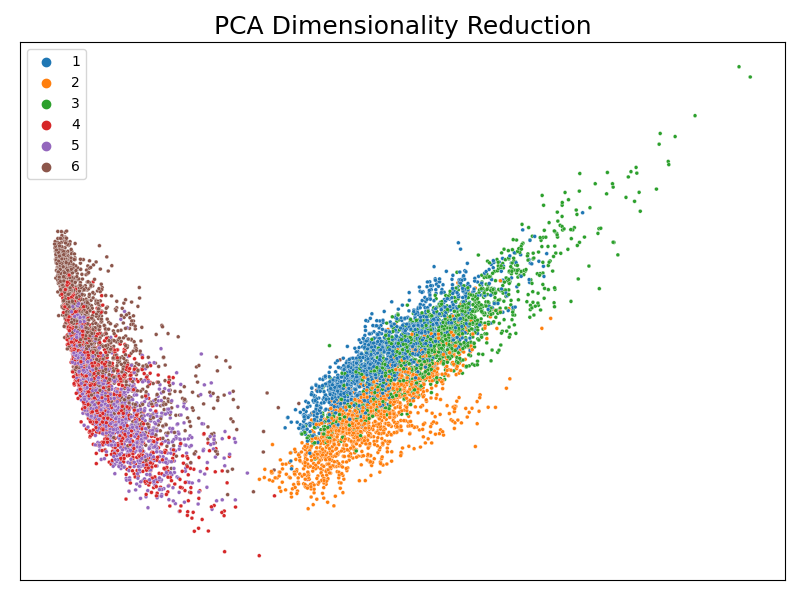
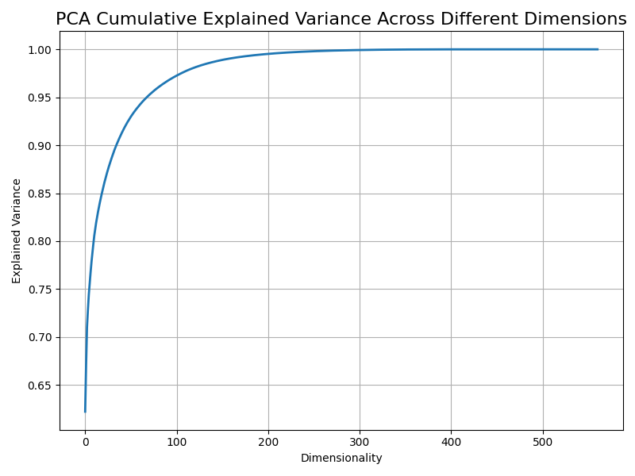
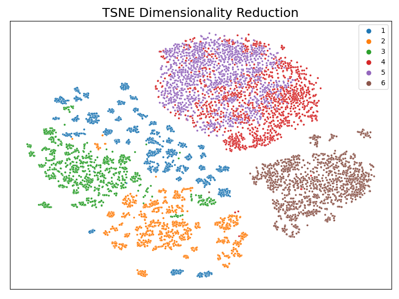
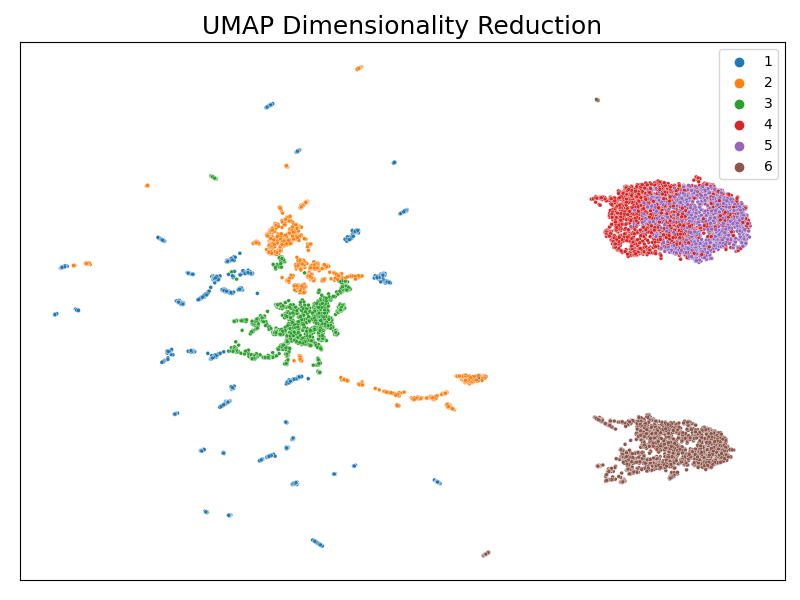
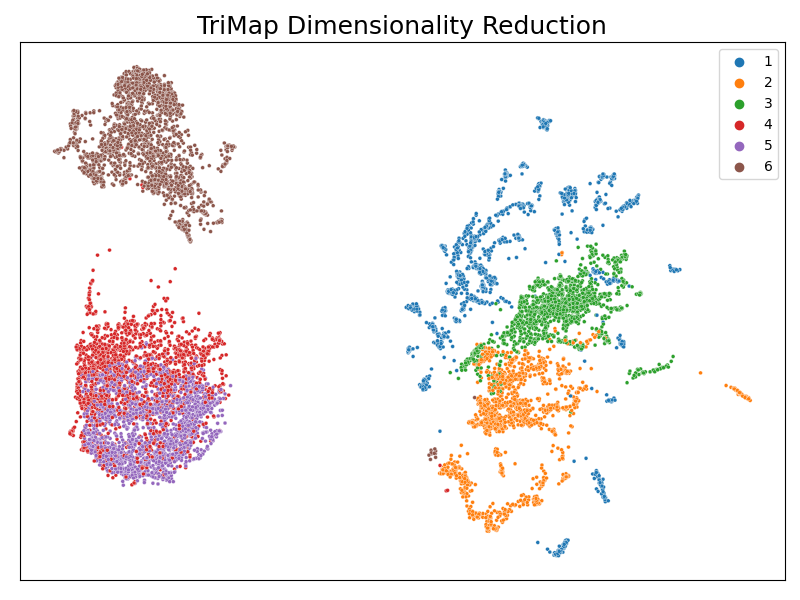
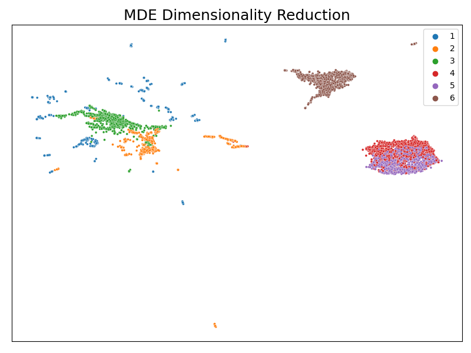

Applying Dimensionality Reduction and Visualization on Selected OpenML Dataset
==============================
This is a submission of **assignment 3** for the **CIS726** course.

It contains the code necessary to conduct dimensionality reduction techniques and inspect the resulting effects.

The [HAR](https://www.openml.org/search?type=data&sort=runs&id=1478) dataset from OpenML has been used as the default
dataset.

Collaborators 🥇
------------
* Tariq Sha'ban
* Rand Agha
* Lujain Ghazalat

Getting Started
------------
Clone the project from GitHub

`$ git clone https://github.com/tariqshaban/dimension-reducer.git`

No further configuration is required.

Usage
------------
Simply run the notebook on any IPython distro.

Methodology
------------
The main operations conducted in this repository are thus:

* Fetch the dataset from OpenML.
* Perform the following dimensionality reduction techniques:
  * PCA 
  * TSNE 
  * UMAP
  * TRIMAP
  * MDE
* Visualize the dimensionality reduction effect.
* Repeat the steps while modifying the following parameters:
  * Generic parameters:
    * Whether to perform shuffling on the dataset or not.
    * The random state (seed).
  * PCA parameters:
    * The number of rows to limit, if any.
  * TSNE parameters:
    * The number of rows to limit, if any.
    * Perplexity.
    * Learning rate.
    * Number of iterations.
  * UMAP parameters:
    * The number of rows to limit, if any.
    * Number of neighbors.
    * The effective minimum distance between embedded points.
  * TRIMAP parameters:
    * The number of rows to limit, if any.
    * Number of iterations.
  * MDE parameters:
    * The number of rows to limit, if any.
* Observe each parameter's effect on the visualization.

The Dataset 
------------
The code uses the `Human Activity Recognition (HAR)` dataset by default, and can be easily changed (under a set of
predetermined constraints, *see notes*), this section's goal is to familiarize with the `HAR` dataset and any other
concept related to the dataset.

> #### OpenML *HAR* Dataset Description
> Human Activity Recognition **(HAR)** database built from the recordings of 30 subjects performing activities of daily
living (ADL) while carrying a waist-mounted smartphone with embedded inertial sensors. This dataset version contains
all the training and testing examples provided in the original data repository.
  
The experiments have been carried out with a group of 30 volunteers within an age bracket of 19-48 years. Each person
performed six activities (WALKING, WALKING_UPSTAIRS, WALKING_DOWNSTAIRS, SITTING, STANDING, LAYING) wearing a
smartphone (Samsung Galaxy S II) on the waist. Using its embedded accelerometer and gyroscope, we captured 3-axial
linear acceleration and 3-axial angular velocity at a constant rate of 50Hz. The experiments have been video-recorded
to label the data manually. The obtained dataset has been randomly partitioned into two sets, where 70% of the
volunteers were selected for generating the training data and 30% the test data.

Based on the documentation, it can be found that:

  
The raw data is captured using a phone's accelerometer and gyroscope sensors:

> #### Accelerometer Sensor
> 
> 
> A sensor in which captures the change (Δ) in velocity, or the acceleration in short.

> #### Gyroscope Sensor
> 
> 
> A sensor in which captures the change (Δ) in orientation.

 

  
The dataset labels are:

* 1 → WALKING
* 2 → WALKING_UPSTAIRS
* 3 → WALKING_DOWNSTAIRS
* 4 → SITTING
* 5 → STANDING
* 6 → LAYING

 

  
The signals (sensor's data stream) are:

  * tBodyAcc-XYZ
  * tGravityAcc-XYZ
  * tBodyAccJerk-XYZ
  * tBodyGyro-XYZ
  * tBodyGyroJerk-XYZ
  * tBodyAccMag
  * tGravityAccMag
  * tBodyAccJerkMag
  * tBodyGyroMag
  * tBodyGyroJerkMag
  * fBodyAcc-XYZ
  * fBodyAccJerk-XYZ
  * fBodyGyro-XYZ
  * fBodyAccMag
  * fBodyAccJerkMag
  * fBodyGyroMag
  * fBodyGyroJerkMag

 

  
The operations conducted on the signals are:

  * **mean()**: Mean value
  * **std()**: Standard deviation
  * **mad()**: Median absolute deviation 
  * **max()**: Largest value in array
  * **min()**: Smallest value in array
  * **sma()**: Signal magnitude area
  * **energy()**: Energy measure. Sum of the squares divided by the number of values. 
  * **iqr()**: Interquartile range 
  * **entropy()**: Signal entropy
  * **arCoeff()**: Autorregresion coefficients with Burg order equal to 4
  * **correlation()**: correlation coefficient between two signals
  * **maxInds()**: index of the frequency component with largest magnitude
  * **meanFreq()**: Weighted average of the frequency components to obtain a mean frequency
  * **skewness()**: skewness of the frequency domain signal 
  * **kurtosis()**: kurtosis of the frequency domain signal 
  * **bandsEnergy()**: Energy of a frequency interval within the 64 bins of the FFT of each window.
  * **angle()**: Angle between to vectors.

Findings
------------
Assuming that the default dataset `HAR` was used and the default values are maintained, the resulting plots should be
similar to the following:

> 
> 
> The PCA technique could not effectivity differentiate between all the classes. 
  

> 
> The PCA will perfectly represent the original dataset if the dimensions were reduced to approximately 250
(the discarded sigma value is effectively zero).

> 
>
> The TSNE technique did not succeed in differentiating between class 4 and 5.

> 
> 
> The UMAP technique did not succeed in differentiating between class 4 and 5, also, class 1 appears to be more sparse.

> 
> 
> The TriMap technique did not succeed in differentiating between class 4 and 5.

> 
> 
> The MDE technique did not succeed in differentiating between class 4 and 5, also, class 1 appears to be more sparse.

According to the results, it is relatively hard to conclude the 'best' method for the dataset, however, the `TSNE` and
`TriMap` visually appears to produce the most acceptable results. It is highly recommended to resort to mathematical and
scientifically proven metrics to conclude and evaluate the best method, perhaps by employing inter-clustering and 
intra-clustering principles?

Notes
------------
* The results highly vary when the parameters are changed, or when the seed is modified.
* Most of the input parameters default to the library's documentation.
* The execution time can be lessened by limiting the number of rows (truncating), however, suboptimal results are
  likely to occur.
* The code is optimized to run on different datasets from the OpenML library without changing anything but the dataset's
  source name.
* **Dataset is assumed to contain non-null numerical attributes and has a multiclass label.**

--------
